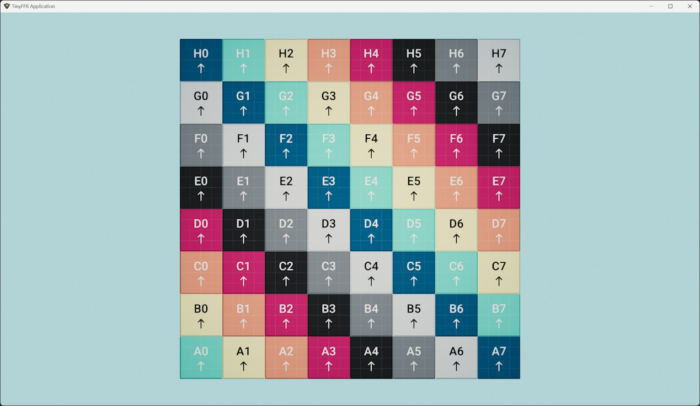
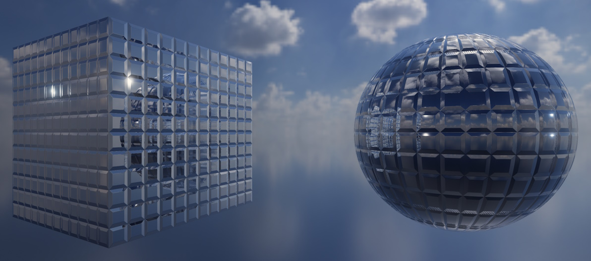
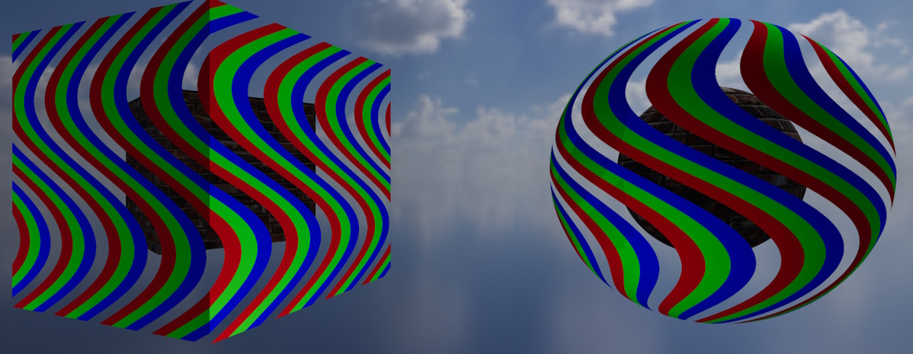
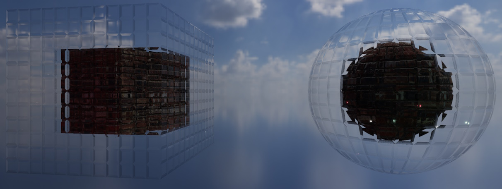

#  TinyFFR

A **Tiny** **F**ixed **F**unction **R**endering library for C#/.NET 9+.

* Delivered via [NuGet](https://www.nuget.org/packages/Egodystonic.TinyFFR/)
* Supports Windows, MacOS (Apple Silicon only), Linux (Debian/Ubuntu)
* Standalone or integrated with WPF, Avalonia, Winforms
* Free for commercial and non-commercial use ([see license](https://github.com/Egodystonic/TinyFFR/blob/main/LICENSE.md))
* Physically-based rendering (via [filament](https://github.com/google/filament))
* Asset loading (via [assimp](https://github.com/assimp/assimp) and [stb_image](https://github.com/nothings/stb))
* Window management and input handling (via [SDL](https://github.com/libsdl-org/SDL))
* Fully-abstracted math & geometry API - no pre-existing 3D or linear algebra knowledge required
* Zero-GC design

## Manual

Manual is available at [tinyffr.dev](https://tinyffr.dev).

## Hello Cube

```csharp
// Tutorial: https://tinyffr.dev/tutorials/hello_cube/

using Egodystonic.TinyFFR;
using Egodystonic.TinyFFR.Factory.Local;
using Egodystonic.TinyFFR.Environment.Input;

using var factory = new LocalTinyFfrFactory();
using var cubeMesh = factory.MeshBuilder.CreateMesh(Cuboid.UnitCube);
using var cubeMaterial = factory.MaterialBuilder.CreateTestMaterial();
using var cube = factory.ObjectBuilder.CreateModelInstance(cubeMesh, cubeMaterial, initialPosition: (0f, 0f, 1.5f));
using var light = factory.LightBuilder.CreatePointLight(Location.Origin);
using var scene = factory.SceneBuilder.CreateScene();
scene.Add(cube);
scene.Add(light);
using var window = factory.WindowBuilder.CreateWindow(factory.DisplayDiscoverer.Primary!.Value);
using var camera = factory.CameraBuilder.CreateCamera(initialPosition: Location.Origin, initialViewDirection: Direction.Forward);
using var renderer = factory.RendererBuilder.CreateRenderer(scene, camera, window);
using var loop = factory.ApplicationLoopBuilder.CreateLoop(60);
while (!loop.Input.UserQuitRequested) {
    var deltaTime = (float) loop.IterateOnce().TotalSeconds;
    if (loop.Input.KeyboardAndMouse.KeyIsCurrentlyDown(KeyboardOrMouseKey.Space)) cube.RotateBy(90f % Direction.Down * deltaTime);
    renderer.Render();
}
```



----

## Asset Loading

```csharp
// Tutorial: https://tinyffr.dev/tutorials/loading_assets/

using var sceneBackdrop = assetLoader.LoadBackdropTexture(@"belfast_sunset_puresky_4k.hdr");

using var treasureChestMesh = assetLoader.LoadMesh(@"treasure_chest_4k.gltf"); 
using var treasureChestColorMap = assetLoader.LoadColorMap(@"treasure_chest_diff_4k.jpg"); 
using var treasureChestNormalMap = assetLoader.LoadNormalMap(@"treasure_chest_nor_gl_4k.jpg"); 
using var treasureChestOrmMap = assetLoader.LoadOcclusionRoughnessMetallicMap(@"treasure_chest_arm_4k.jpg"); 
using var treasureChestMaterial = materialBuilder.CreateStandardMaterial( 
    colorMap: treasureChestColorMap,
    normalMap: treasureChestNormalMap,
    ormOrOrmrMap: treasureChestOrmMap
);

using var treasureChest = objectBuilder.CreateModelInstance(
    treasureChestMesh, 
    treasureChestMaterial, 
    initialPosition: (0f, -0.3f, 1f) 
);

scene.SetBackdrop(sceneBackdrop);
scene.Add(treasureChest);
```


----

## Material Examples

### Anisotropic Metal


### Transmissive Glass w/ Absorption


### Reflective


### Alpha-masked


### Refractive


### Normal Mapped

